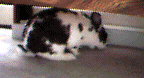

# Ah, This is the Life

In addition to grooming each other, rabbits love to just hang out and gaze at each other and you. Sitting on the floor near your rabbit and just gazing or chatting (the rabbit won’t talk back except with nose wiggling and ear signaling) is considered very companionable. Some rabbits like to sit in front of the television while you watch it. Fortunately, they don’t seem to realize you aren’t watching them.

A resting rabbit has several body positions to indicate just how comfortable and happy with the world it is. As a general rule, the harder it is to get up from a position quickly and run, the more the rabbit is indicating that it’s relaxed and comfortable.

Calm contemplation is indicated by lying on one’s belly with front and rear legs tucked under, with ears up and facing forward. As a rabbit relaxes, its back will sink lower and the rabbit will flatten, which on a fat rabbit can look like it’s turning into a big fur puddle. The legs-tucked-under position is most commonly called the “meatloaf” (also called the “bunny hen,” or, if the forelegs are stretched forward, the “sphinx”). An even more relaxed lying position includes one or two rear legs stuck out sideways, with the body often stretched out and sometimes rolled a bit to the side. A rabbit lying like this is indicating that it is very comfortable. Some people call this pose the “lambchop.” A more relaxed variant of the lambchop has the rabbit with its feet stretched out directly behind.

Very relaxed rabbits will roll onto their sides or even on their backs. A favorite way to do this is to first twist one’s head sideways, then fling the rest of the body into line so that the feet fly out to the side. This is called a “flop” and indicates a very happy bunny. A happy rabbit may lie on its side (or back), and stretch or wiggle or sometimes just hold still there. It may even roll its eyes a bit so that the white shows. When you first see this you will probably be afraid your rabbit is dead, because it looks pretty odd. If you rush over to give it CPR, it will quickly right itself and look strangely at you for disturbing a nice stretch.

Note: If rabbits don’t get along they may play a little game one could call “I’m happier than you are.” Usually when a rabbit flops near another it shows how comfortable it is with the other, but with rabbits that are not good friends it can actually be used as a mild insult. When used in this way it means something similar to the “I don’t care about you” insult described later, but more like “I’m happy and you’re a miserable excuse for a rabbit, so there.”

Marvin with the big setup… and… flop!

[previous page](./yeah-baby-i-like-it-like-that.md "Yeah Baby, I Like It Like That") \| [next page](./follow-my-nose.md "Follow My Nose")
