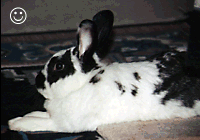
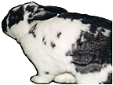
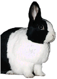
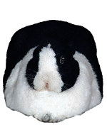
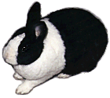
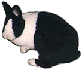
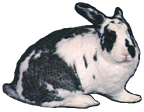

# Alas, Woe is Me

An unhappy rabbit will usually lay its ears back with the openings down, and turn itself either to the side or toward you nervously. The farther back the ears fall, the more unhappiness is indicated. This differs from other ear-back signals, which require that the rabbit firmly face toward you (anger), crouch or turn sideways with ear openings turned sideways (fear), or pointedly turn its back (insult).

A more mild signal of unhappiness (or even some anger) is having one ear facing backward and one forward, or one ear down and one up. These usually indicate a rabbit that is less than happy, but sometimes for only vaguely defined reasons. A little grooming or a raisin gift can often turn that frown upside down. A more serious sulk is indicated by ears tilted far back, or (even worse) tilted back and facing down, all done while lying facing you (or facing to the side; not directly away from you, which is an outright insult) in a meatloaf position. This is a seriously sad rabbit, and you should take some time to think about what might be wrong. It might even be sick, so check the litterbox for evidence.

Note that rabbits often sleep lying with their ears laid back in a fashion very similar to the “sulking” signal and with their eyes narrowed but not closed. They always have particular places they sleep, though, so you probably won’t confuse the two.

A nervous or frightened rabbit will face its ears backward and lower them, but with the openings facing sideways rather than back, and often will point its ears a bit out to the side rather than straight back. If you reach for your rabbit and it lowers its head and ears, spreading its ears or tilting both ears to one side rather than keeping them pointed straight back, it is scared. This is usually accompanied with a stance that leaves the rabbit ready to flee, and may include ducking the head. Mild nervousness may be sometimes shown by stance alone. A scared rabbit will not stand aggressively as if it’s about to charge you, like an angry one will, although otherwise the signals can be a bit related (as are fear and anger).

A rabbit that is dismayed, confused, or trying but not succeeding in communicating with you will sometimes wince. In a wince, one eye gets closed, and the whole forehead moves toward that eye. It’s over in just a second. It looks something like a wink, but it’s a signal of mild unhappiness. When you first try using some of the signals described here, you may get winced at, generally because your body language is not consistent with the signal you’re giving or something about the context is just not right. If your rabbit winces when you try to communicate, you probably need to work more on your conversational skills. However, most rabbits should eventually learn to understand you once they get used to your incredibly bad accent.

A rabbit that is very scared or nervous may “thump” a hind leg, slapping it hard against the ground. This isn’t just a warning to other rabbits, but to you, too. Note that rabbits sometime also thump to indicate anger, or even just to say “pay attention,” but it should be pretty easy to distinguish these by the context.

A rabbit that is scared but can’t run, or one that is nervous, may chatter its mouth (the way humans do when they’re cold). Chattering teeth or loud tooth grinding (not the soft kind heard sometimes during grooming) can also indicate a rabbit in pain, so you should do some checking for indication that it’s sick.

Some rabbits will mutter nervously to themselves. This sound is usually a little higher pitched than the happy mumbling of a rabbit being groomed, and sounds very different from a rabbit grunting as it eats or grunt-growling at you when it’s angry. I’ve been told, though, that some rabbits just always are muttering to themselves, and in such cases doesn’t necessarily indicate nervousness, but is probably just comfortable social mumbling. In fact, female rabbits may “coo” while nursing their pups. The context of the situation should make the meaning pretty clear.

When a rabbit is frustrated with being locked in its cage it may loudly toss things around or otherwise “rattle the bars.” This is meant to get your attention, of course, and typically is a request to be allowed out.

Finally, a rabbit in terror or in severe, acute pain may scream. I’m told it is a terrible sound, but, fortunately, I’ve never heard this vocalization. I sincerely hope you never hear it either.

“Must you keep flashing that thing in my eyes?” (aka “As The Ears Turn”)

[previous page](/why-you-fiend.md "Why, You Fiend!") | [next page](./hmm-what-do-we-have-here.md "Hmm, What Do We Have Here?")

“You don’t love me anymore.”

“I am just not sure about you, Bub.”

“I’ll lend you an ear, but two you’ll have to earn.”

“Ulp!”

“Uh, I think this is where I leave.”

“You’re going to stick that where?!”
