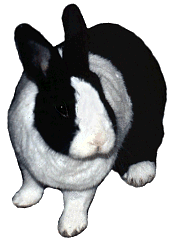

# Betsy Vanderbun

Once upon a time, Diane was sighing about wanting a pet. Her allergies made cats and dogs out of the question. Goldfish were insufficiently cuddly. So Diane’s long-time, long-distance boyfriend, Eric, suggested a rabbit. Diane pondered this idea, then went down to the Toronto Humane Society to see if they had any bunnies. She wanted a nice little dwarf, very affectionate and well behaved.

There were indeed rabbits at the shelter, many of them dwarf. But Diane’s eyes kept on coming back to one black and white Dutch rabbit, cowering in the back of its cage. Diane left to think things over. The Dutch was beautiful, but too big, and so uncivilized – she had been an urban street rabbit (truly!), then lived at the shelter for eight more months. They thought she had been abused. She was quite unsuitable.

Diane couldn’t get the black and white rabbit out of her mind. She came back twice more, and the last time she took the Dutch home. The volunteer at the shelter made Diane promise not to change the rabbit’s name, which was Betsy. She said that Betsy would be a wonderful friend someday. It was a long time before Diane believed her….

At first, Betsy did not come out of the cage, even though the door was left open. But after a few days she stepped out. She kept increasing her range, a few inches at a time, then a few feet at a time. Diane spent many hours sitting on the floor next to the cage, reading Betsy books. Betsy sometimes nibbled on the pages, but never let Diane touch her. Diane even napped on the floor sometimes so that Betsy would get used to her. But still Betsy was a little monster, unapproachable and shy, and deathly afraid of human hands (perhaps from having been hit?). Still, she litter-trained well and over the months she explored the whole apartment. Diane was very proud. Betsy still loved to devour books, so Diane put a set of books on the lower shelf just for her. But Betsy was a difficult, obstreperous bunny just the same.

Soon Diane moved to a new apartment. This one was carpeted. Although Betsy did not like the move itself (she peed all over Diane) she loved the new place. She could run! She was happy, and began to take raisins from Diane’s hand. She even came out from under the couch when company was there – for a few moments, anyway. But still she would not be touched.

About a year and three months after Betsy and Diane moved in together, Eric came to make the household a three-person home. Betsy was not pleased. Who was this third bunny? Low bun on the totem pole, that’s who. Betsy made that clear. Eric was to be abused and attacked, not obeyed. So Eric decided that he would befriend the bunny. He watched her behaviour, and tried to be the best rabbit he could be. He played bunny games and communicated like a bunny. (Ever watched a Ph.D. try to flap his ears?) Soon the two were bonded. Shortly afterward Betsy made it clear that Eric was her love interest. And, wonder of wonders, Betsy started begging to be patted, albeit with Eric’s feet. Soon Diane could do foot pats too.

In the fall, Eric and Diane were married. (Betsy declined to attend, citing agoraphobia.) By November, Eric had started tricking Betsy into being patted with hands. (He’d put his foot over her eyes, then keep going with the hands until she noticed.) By Christmas Betsy would come right up to Eric, and to Diane, to be patted with hands. She and Diane now rubbed noses regularly. Betsy had turned into a snuggle bun! The people at the shelter wouldn’t know her today.

And then Marvin came… but [that’s another story](./marvin-underfoot.md "Marvin Underfoot") altogether.

* * *

### Help! I’m Sick!

Betsy helped us learn another big advantage of knowing how to speak Rabbit: the ability to quickly recognize when something is wrong.

One day Betsy wasn’t being her usual pesky self. She hid in a dark cubby instead of being out where she could keep a close eye on us, as she usually prefers. When she was visible, we saw that she looked somewhat unusual. Her ears were oddly arranged, with one actively communicating and the other apparently not doing much of anything. Closer examination showed that her nose wiggling was way down and she wasn’t moving the whiskers on the side of her face where her ear was silent. We decided that she might have some sort of facial paralysis and made an appointment with her veterinarian for the next day.

The vet agreed that Betsy was having some kind of problem. Just in case it had a bacterial origin, he gave her an antibiotic injection and prescribed an oral antibiotic (since it couldn’t hurt, and rabbits can succumb very quickly to bacterial infection). Within a few days, though, the problem revealed itself. Betsy started holding her head in a twisted, tilted manner, and was leaning strongly toward the “paralyzed” side when lying down. Betsy had a clear case of head-tilt (also known as Torticollis, or wry neck), which is almost always associated with a bacterial inner ear infection. This disease is often fatal, because it can advance very quickly and the bacteria usually at fault (Pasteurella) are only moderately responsive to antibiotics. Even if recognized quickly enough to rescue the Rabbit, a six-month course of treatment is typical, with two oral doses given by hand each day.

Our vet had given us the right medication for this condition, and recommended we continue with it. Although facial paralysis is a very unusual accompanying symptom for held-tilt, the timing was too much of a coincidence to discount, and the bacterial infection was probably the cause of that, too.

During the next week, Betsy got worse, not better. She was leaning way over to the side, didn’t leave her hutch, and avoided moving as much as possible. When picked up for her medicine, she’d spin uncontrollably, and she was clearly suffering from serious vertigo. We brought her in to the vet again, and he switched her to a new oral antibiotic, again to be given twice daily.

During the next few weeks, she continued her regimen of two oral antibiotic doses daily and one injection each week. Slowly, Betsy started improving. Her vertigo eased, and she started getting feeling and motor control back on the damaged half of her face. By three months after the appearance of the first symptoms, she was almost back to normal. Today Betsy is virtually a new rabbit. Aside from a very slight tilt to her head, she’s every bit as frisky, pesky and in-your-face as she ever was. In fact, she’s even more overtly affectionate than she was, so maybe being picked up twice a day (which she hated, even though we mixed the medicine with banana paste) wasn’t altogether a terrible thing. Her treatment took half the time commonly required, and we attribute it in part to our quick recognition of the problem, and our vet’s quick reaction in putting her on antibiotics when the infection was still in its earliest stage.

The important lesson: **Know and Listen to Your Rabbit!**

