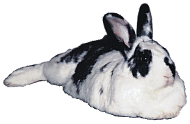

# Follow My Nose

Most rabbits at rest will be wiggling their noses. Rabbits don’t need to do this to smell things, and they don’t necessarily do it in time with their breathing, and they sometimes stop completely. So why do they do it at all? A rabbit’s nose is like a thermometer for how interested it is in what’s being observed. The faster the wiggling, the more attentive or agitated the rabbit is. Nose wiggle signaling is generally only used by rabbits that are already moderately relaxed.

A fast wiggle doesn’t necessarily mean a rabbit is upset. It may just signal interest in something being witnessed, or some passing thought. A slowly wiggling nose indicates a calm rabbit. Rabbits usually use nose wiggling to indicate fine gradations in their mood. If you start moving around or doing something odd, that nose will start moving faster, and the rabbit may also turn its ears to focus more upon you. If a rabbit is considering fleeing, though, it will usually stop wiggling its nose completely.

One way to help calm a rabbit is to do the equivalent of whispering “there, there, it’s all right” using slow nose wiggling. Of course, humans can’t really wiggle their noses properly (OK, maybe you can), but rabbits will understand if you just use your upper lip. If you roll your upper lip under your top teeth and back again, this looks much like a rabbit nose wiggle. It’s especially effective if you happen to have a mustache. On the other hand, some folks can actually wiggle their noses enough for the rabbit to recognize it. Experiment to see what your rabbit responds to.

You may also notice a rabbit will suddenly stop wiggling its nose, and this is a signal too. It seems to mean either that the interest level has gone beyond the highest wiggle rate, or that what is being observed is somehow confusing (either or both, depending on the context).

You might have fun with this rabbit conversational technique, which is also a good way to test if your nose wiggling is being done properly. (Warning: Doing this can make your family fear for your sanity.) Lie on the floor facing your rabbit while it’s sitting or lying a few feet away. Your rabbit, who will be curious about what you’re doing, will probably indicate its attention by speeding up its nose wiggling. Do your own wiggling, but a little more slowly than the rabbit. The rabbit’s nose will probably slow. As its nose slows, keep slowing yours until you are both wiggling at a sedate pace. Then start speeding up your wiggling without doing anything else. You’ll probably see the rabbit start going faster too! Then you can both slow down to a calm, life-is-good rate of wiggling again. Personally, I only do this when no one else is watching.

[previous page](./ah-this-is-the-life.md "Ah, This is the Life") | [next page](./r-e-s-p-e-c-t-is-what-my-bun-demands-of-me.md "R-E-S-P-E-C-T is What My Bun Demands of Me")

**How does nose wiggling relate to other signals?**

Body position is the best indicator for **relaxation**, and ear position shows **attentiveness** (among other things). Nose wiggling rate seems to say more about the personal **interest** the rabbit has in what is being observed.

These three aspects of mood are typically related, but don’t have to always move together. For instance, a relaxed but attentive rabbit doesn’t necessarily have to be particularly interested in what it’s seeing, although it may be.
