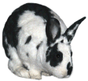
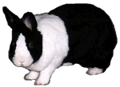

# Hmm, What Do We Have Here?

Like all mammals, rabbits are very curious by nature. As soon as they’re comfortable with their nearby environment, they’ll start exploring beyond it. An extremely curious rabbit is very easy to recognize, because it’s the only time you’ll find their ears tilted forward, often with their necks stretched out a bit. Their ears will also be facing forward, of course, to catch every bit of juicy news. Some folks call this forward-tilting ears pose the “baseball cap.” You can think of it also as Sherlock Holmes’ hat (or Investigator Bunny’s).

When their curiosity is aroused, but usually before they come over to investigate personally, they’ll sometimes spread their ears out to each side like a (rabbit ears) television antenna, and turn them directly ahead, to get a wide stereo field of “view.” Sometimes rabbits use wide stereo ears when they’re nervous too, in which case they certainly won’t be stretching their necks forward, and may also turn their bodies a bit to the side in case they need to flee.

The most polite response to a curious bunny who has come over to investigate is to give it a portion of whatever it is curious about. A little something to sniff, to nibble, or to toss in the air perhaps. When a rabbit comes over and signals that it’s curious, it wants to share in what you’re doing. Or sometimes, as when you’re cleaning a cage, to be sure that you’re doing everything correctly.

Curious rabbits sometimes will rear up onto their hind limbs and stand tall to look around, which is called “periscoping.” Unfortunately, they are rather bottom-heavy creatures and have a tendency to tumble over backwards when doing so. Just try not to laugh.

[previous page](./alas-woe-is-me.md "Alas, Woe is Me") | [next page](./pleeeeease-oh-please-please-please.md "Pleeeeease Oh Please Please Please!")

“Why, Watson, I do believe we have found a clue…”

“Verrrrry interesting.”
