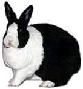
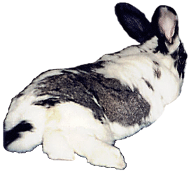

# Index

This index provides a quick way to look up the most common meanings of the most common signals. However, context is always critical, and very few signals appear alone or without additional cues that make their meaning more clear. As a result, it’s not possible to use this index like a dictionary in which you can look up a specific signal and learn its inevitable meaning.

To truly understand Rabbit properly, you’ll need to read this whole guide and then learn to notice which signals appear together under which circumstances. It takes some work, but all relationships do.

- Ears
  - Turned
    - [Forward, attentively](./ah-this-is-the-life.md)
    - [Sideways, in fear](./alas-woe-is-me.md)
    - Backward
      - [Angry](./why-you-fiend.md)
      - [Insulted](./r-e-s-p-e-c-t-is-what-my-bun-demands-of-me.md)
  - Tilted
    - [Forward, deeply curious](./hmm-what-do-we-have-here.md)
    - [Up, calmly](./ah-this-is-the-life.md)
    - [Sideways, in fear](./alas-woe-is-me.md)
    - Backward
      - [Angry](./why-you-fiend.md)
      - [Insulted](./r-e-s-p-e-c-t-is-what-my-bun-demands-of-me.md)
      - [Grooming, invitation](./yeah-baby-i-like-it-like-that.md)
  - [Wobbled](./r-e-s-p-e-c-t-is-what-my-bun-demands-of-me.md)
- [Eyes, wincing](./alas-woe-is-me.md)
- Feet
  - [Thumping](./alas-woe-is-me.md)
  - [Front feet stuck out forward](./ah-this-is-the-life.md)
  - [Hind feet stuck out sideways or backwards](./ah-this-is-the-life.md)
- Noses
  - [Touching](./r-e-s-p-e-c-t-is-what-my-bun-demands-of-me.md)
  - [Wiggling](./follow-my-nose.md)
- Body
  - [Facing direction](./r-e-s-p-e-c-t-is-what-my-bun-demands-of-me.md)
    - [Toward you](./r-e-s-p-e-c-t-is-what-my-bun-demands-of-me.md)
    - [Sideways to you](./r-e-s-p-e-c-t-is-what-my-bun-demands-of-me.md)
    - [Away from you](./r-e-s-p-e-c-t-is-what-my-bun-demands-of-me.md)
  - Stance and other arrangement
    - [Head-down for grooming](./yeah-baby-i-like-it-like-that.md)
    - [Front feet wide to charge in anger](./why-you-fiend.md)
    - [Periscoping, on two feet](./hmm-what-do-we-have-here.md)
    - [Lying](./ah-this-is-the-life.md)
      - [Sphinx](./ah-this-is-the-life.md)
      - [Lambchop](./ah-this-is-the-life.md)
      - [Flopped](./ah-this-is-the-life.md)
      - [Upside-down](./ah-this-is-the-life.md)
    - Movement
      - [Racing around](./the-need-for-speed.md)
      - [Chasing, an invitation for](./the-need-for-speed.md)
      - [Leaping/Binky](./did-you-say-binky.md)
      - [Flopping](./ah-this-is-the-life.md)
- Sounds
  - [Grunts during eating](./yippie-skippie.md)
  - [Growl-grunt](./why-you-fiend.md)
  - [Mumbling](./yeah-baby-i-like-it-like-that.md)
  - [Muttering](./alas-woe-is-me.md)
  - [Thumping hind feet](./alas-woe-is-me.md)
- [Tail, extended when aggressive](./why-you-fiend.md)
- Biting and nipping
  - [Happy, dancing around you](./yippie-skippie.md)
  - [Angry](./why-you-fiend.md)
  - [Wanting attention](./yeah-baby-i-like-it-like-that.md)
  - [Telling you to stop or go away](./why-you-fiend.md)
- [Tongue, licking](./prove-that-you-love-me.md)

[previous page](./bibliography.md "Further Reading") | [home](./intro.md "Introduction")

