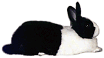
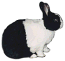
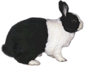

# Introduction

Welcome to the Language of Lagomorphs, your guide to speaking fluent Rabbit. Or something like that!

Being able to speak and understand Rabbit requires that you learn to think at least a little like a rabbit. Your rabbit will never learn to understand many of the mysterious things **you** do (“Why the heck did she just change into three different outfits before leaving for work?”), but you can certainly understand why rabbits do what they do. You’ll be pretty close to the truth if you think of rabbits as being from a society very different from your own, with different priorities, goals, important lessons, and gestures. Learning Rabbit is in some ways like human cultural studies, but of course the subject individuals have much longer ears.

People who expect rabbits to be like dogs often find the most important difference in the relationships they form with humans is that dogs may give unconditional love and trust, but rabbits don’t. Please repeat after me… rabbits are not like dogs, rabbits are not like cats, rabbits are like rabbits. This is why it’s so important to know how they think and what they want! As it turns out, what all rabbits want more than anything is respect and affection, and when you learn to give these properly (i.e. like a rabbit) you’ll freely get them in return.

A great deal of the signaling described here involves the use of uppy ears, which not all domestic rabbit breeds have. Lop-eared rabbits will move their ears in a manner consistent with what uppy eared rabbits will do, but the results are usually much less obvious. Different lops will vary in how they are capable of moving their ears, and may therefore be able to use only certain of the ear signals described here. Still, with close attention you may be able to draw almost as much information from the behavior of a lop as an uppy eared rabbit. You can consider Lop as the language Rabbit, but spoken with an accent.

Some signals’ descriptions might be superficially similar and yet have very different meanings. For instance, an angry rabbit, one that’s scared, and one asking to be groomed will all have their ears back. Accompanying signals will almost always indicate the real meaning, but the situation’s **context** (i.e. recent events) will also help to make things clear.

Rabbits use a lot of special postures to signal others, but just because some particular action or pose is a signal in one context doesn’t mean that every time a rabbit does it a meaningful signal is intentionally being given. As Sigmund Freud once said, sometimes a cigar is just a cigar. Don’t worry if some of the material here seems a bit complicated or hard to master. Humans are excellent at recognizing nonverbal communication, including context and accompanying signals. We do it all the time with each other, and it comes quite naturally.

This guide runs a bit long for the sake of completeness, and you probably won’t remember everything you’ve read after one time through. However, if you come away with a good idea of what is important to rabbits, and a general feel for how they express themselves, you’ll do just fine. You can always come back to the guide later and easily find confirmation and clarification for what you’ve seen.

It’s worth noting that the rabbits whose pictures appear here are neutered, as should always be the case if breeding is not a requirement. For brevity, this guide doesn’t include signals used exclusively or almost only by unneutered rabbits. Unneutered rabbits are often significantly more aggressive, and may be less interested in conversing with you about anything but hierarchy and territoriality. Perhaps you can remember when you were irresistibly hormone driven (last weekend at the neighborhood barbecue?) and will understand. We can only hope that you didn’t mark your territory by spraying urine all over.

The stars of this site are two rabbits who patiently provided the poses I’ve used to illustrate the text: Betsy (a black Dutch) and Marvin (a tricolored, broken-patterned mix). They’re supermodels of the rabbit world. My wife provided insightful suggestions and kindly editing, as well as Betsy and Marvin’s biographies.

Finally, this guide isn’t about training your rabbit, or about how to bond two rabbits, which are also important aspects of behavior. You can learn more about these activities elsewhere, in resources given in the [Further Reading page](./bibliography.md). Learning to speak Rabbit, though, will help with every other aspect of living with a rabbit. Oh, it’s also kind of fun.

#### The Basic Bunny Body Positions

Lying

Sitting.

Standing

[Next page…](./prove-that-you-love-me.md "Prove That You Love Me")

**Do rabbits really use “language?”**

Well, scientifically speaking, no. One of the primary characteristics of language is syntax. Syntax means that words are put together into phrases using ordering rules that affect meaning. It’s part of grammar.

The scientific term for how rabbits communicate is “signaling.” Signals don’t necessarily have to be presented in a particular order. They can change meaning under different contexts, though, and that certainly is important in rabbit communication.

Nonscientifically speaking, though, a language can be any system of signs, signals and utterances that are used to communicate. Under that definition, anyone would agree that rabbits have a very sophisticated language for a non-human species.

This Language of Lagomorphs ebook has been online helping people and bunnies understand each other since 1999 — Woo!
