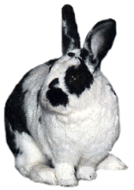

# Marvin Underfoot

Marvin Underfoot joined the household from the Toronto Humane Society. They said he had been found in an abandoned public housing unit, and when Diane and Eric first met him he was a somewhat unprepossessing figure – shorn from the waist down to get rid of what must have been horribly matted fur. His poor crooked leg stuck strangely out to one side. The volunteers at the shelter had named him “Marvin the Magnificent,” but it was clearly meant as a joke.

Diane and Eric already lived with one rabbit, and thought that she could use a friend. Diane checked out all the rabbits at the shelter, but Eric went straight to Marvin and stayed there. Diane could see his point. Marvin seemed like an easygoing sort, and there was something attractive in him despite his, well, silly appearance. The volunteer at the Humane Society was going to send Marvin off to live at a farm – clearly she thought he was un-adoptable. She should have remembered Diane from when she picked up Betsy….

So this matted and sorry-looking guy came home. He sat patiently while Diane cleaned him up and took out the mats the shaving hadn’t caught. All of the fur on his forehead and a lot on the rest of his body fell out all at once, within days. He looked ridiculous, but Diane and Eric tried not to laugh. He settled in immediately and seemed pleased to be home at last.

Now he has grown a beautiful, lush coat and he is heart-stoppingly handsome. You can hardly even see the crooked leg now that his longish, silky fur has grown in, although he does run sort of funny still. (It became clear how the injury must have happened, by the way: he loves to prance around and under people’s feet. His name is now Marvin Underfoot, and it’s a wonder he hasn’t had both his legs stepped on!)

Marvin Underfoot and Betsy Vanderbun did not fall in love at first sight: Betsy did not take kindly to the invasion of her territory, to say the least. To spare you the details, let’s just say that they live separately and are “best enemies.” (When Betsy was sick and staying over at the vet, Marvin moped around miserably until she came home.)

Marvin is a good eater. He’ll eat just about anything green, except avocado, which makes him thump. (Holy guacamole, Batman!) Diane and Eric have to be very careful about locking up the pellets or he will burrow into the box and try to eat till he explodes. Diane once caught him with his head in her purse, butt twitching with joy. She pulled the bag off his head and found that he had been eating a pack of sugarless gum (peppermint) – foil wrappers and all. There were no ill effects, luckily. Now she keeps her purse zipped up, and so far he hasn’t managed to open it – but given time, he’ll probably figure something out.

Marvin is king of the dramatic flop, and he has incredibly expressive ears. He truly is Magnificent.

Huh?
