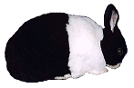
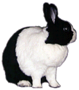
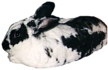
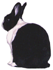

# R-E-S-P-E-C-T is What My Bun Demands of Me

You’ve probably heard that Eskimos have many words for different types of snow, it being so important to their daily lives. Well, rabbits have many expressions that mean, “You’ve offended me,” which indicates how important respect and insults are to rabbits. Disagreements don’t usually require a brawl, but they do typically require that someone get insulted and someone apologize. Since the apology usually just requires some forehead stroking, and maybe a conciliatory raisin, it’s worth trying to get back on your bunny’s good side. If the rabbit is really pissed off, though, you may have to just suffer the humiliation of being shunned. After a while, you’ll be allowed to apologize. An offended rabbit who is not apologized to can hold a grudge or maintain a sulk for many, many days.

There is an escalating set of moves that a rabbit will use to indicate everything from “I don’t care about you anyway,” to “You are the scum of the earth,” as exemplified in The Offendedness Scale given below. To some extent, a rabbit’s body position and the direction its ears are facing are like coarse and fine dials for mood, which when pointed at you are good and when pointed away are bad. When a rabbit is facing you directly, with its ear openings facing you, you are being accorded respect and appreciation. When the ears and/or body start being turned to face away from you, you’re being told that your behavior has been questionable. (Note: Some rabbits like to have their backs scratched or to be groomed with their backs turned, in which case they will remain in easy reach or even pressed against you. Insulted rabbits will typically step away, at least slightly beyond easy reach.) If a rabbit turns away completely, and folds its ears down onto its back, you are definitely in the doghouse. You can confirm this by offering a raisin, which will probably be rebuffed (“I don’t want any of your lousy raisins.”) Only the passage of time will allow you to be given the opportunity to redeem yourself.

If these moves are performed while sitting, then a conversation is in progress, and you can act to improve your status with a suitable apology. But if the rabbit is lying down, then a conclusion has been reached, and you will have to work harder to make amends, maybe not even until later after you’ve learned your lesson.

* * *

### The Offendedness Scale

Offense Level: 1 — Skeptical  
What They Do: Rabbit moves into your vicinity, faces you a moment, then examines the ground around its feet as if there is something there much more interesting than you are.  
What It Means: “Not everything is about you, ya know.” (May be used just to show you who’s boss.)

Offense Level: 2 — Wary  
What They Do: Rabbit sitting in your vicinity turns sideways, or a little turned away, ears up, and looks at you with one eye.  
What It Means: “Hmm, what’s your problem?” or “Just what do you mean by that, buddy?”  
(Not always meaningful, though.)  

Offense Level: 3 — Annoyed  
What They Do: Rabbit’s ears are sloping back instead of held upright, but still turned to face forward or sideways.  
What It Means: “You’re not a nice person.”  

Offense Level: 4 — Peeved  
What They Do: Rabbit steps away a bit (out of easy grooming range) and turns its back to you, but looks over its shoulder to make sure you’re noticing.  
What It Means: “You’re in some trouble now, mister.”  

Offense Level: 5 — Insulted  
What They Do: Rabbit turns and hops away, flicking its feet quickly backward and to the sides in an exaggerated way, often making a sort of whooshing noise (a “foot-flick,” or being “flipped off”).  
What It Means: “I am shaking your dust off my heels.”

Offense Level: 6 — Shunning  
What They Do: Rabbit turns its back to you and sits or lies down, without even looking back.  
What It Means: “You are behaving unacceptably.”

Offense Level: 7 — Deeply Hurt  
What They Do: Rabbit turns its back to you, lies down, and folds its ears all the way down, to shut out both the sight and sound of you.  
What It Means: “You are the scum of the earth. I’ll have nothing to do with you.”

* * *

By the way, two can play the “I’m offended” game. If a rabbit is not behaving properly (sitting upon inappropriate furniture, for example) and you want to indicate this in a mild way using language it will understand, go ahead and show that you’re insulted. You have to do this right after the rabbit does something bad for it to work. Go right up to the rabbit, take one step backwards, and turn your back pointedly. You might watch by peeking over your shoulder a bit, to indicate that you are willing to forgive. If your rabbit comes over to sniff or poke you with its nose, you may choose to provide a small pat on the forehead to indicate forgiveness. Rabbits are sensitive to feeling shamed.

Of course, if the problem behavior is something really bad, you should first shout “No” and make it stop before demonstrating that you are offended. In this case, you may end up back to back, in an insult contest. If so, try wiping your face and hair a bit (i.e. grooming yourself), to show that you’re willing to stand there forever until an apology is forthcoming. If none is given, walk away, flicking your feet backwards. Make sure the rest of your family understands what you’re doing so they don’t drag you to the psychiatrist. Warning: they might do so anyway.

Rabbits use an ear wobble (or head wobble for lops) not as an insult, but to politely say “no thank you” or “I’d rather not.” The ear wobble is a gentle twist of the neck back and forth once or twice that makes the ears move from side to side, and is usually done while standing and facing you. Some situations that can evoke an ear wobble are when you offer food that the rabbit isn’t interested in, or when you try to slip your hand under its chin and it doesn’t want to groom you (although some rabbits will find this outright insulting if you’re assuming a privilege you are definitely not entitled to).

Incidentally, it is considered very insulting to hop quickly by right in front of another rabbit or you without stopping for a moment to offer the polite rabbit greeting of touching noses. Obviously, a rabbit can’t ponder peacefully while someone rushes back and forth in front of its face, and rabbits looking for trouble with other rabbits will do exactly this. You may encounter one consequence of this behavior yourself if you walk right past your rabbit quickly, in which case the rabbit might even charge at you in outrage! You can avoid this by giving an equivalent to touching noses when you walk by: a quick pat on the forehead. Not all rabbits are so easily insulted, though.

Finally, there is the all-out nuclear weapon of insults, reserved only for the most offensive, utterly unacceptable, good for nothing individuals and behavior: urine. And if you’ve ever had to clean up a pungent puddle of bunny pee, often bright yellow, orange, or even red, and more than a little odorous, then you know just how powerful this weapon really is. Note that urine used for marking territory and ownership is another story entirely. But when your rabbit pees on your pillow (yes, it happens), you have obviously qualified as the lowest of the low. If you respond in kind, then you probably deserved it.

[previous page](./follow-my-nose.md "Follow My Nose") \| [next page](./gimme-some-space-man.md "Gimme Some Space, Man")
