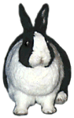
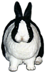

# Why, You Fiend!

Occasionally, you will see a rabbit enraged. You might accidentally make a social “faux paw,” which may result in anger, before leading to the inevitable conclusion that you are guilty of insult. Or you might have gotten yourself into real trouble, leading to sulking and destructive behavior. It’s useful to be able to recognize the range from uneasy to furious, since this can save you from a lot of apologizing and making up later, as well as possibly saving your rugs.

Rabbits express anger using their ears, stance, and tail. Ears are most important. A happy rabbit keeps its ears pointed up and turned forward. Increasing anger is indicated by turning the ears to first point sideways, then backward. A raised tail, held out from the body instead of tight against the bum, shows excitement and agitation.

The greatest outrage is shown by lowering the backwards-pointing ears down to the body. You won’t mistake this for an invitation to grooming, because that is accompanied by lowering the chest all the way to the ground too, which an angry rabbit never does. At the extreme, a rabbit’s tail will be held out stiffly and it will look ready for a leap forward. If you see this, then you’re facing one very pissed off bunny.

Stance indicates what the rabbit is going to do about its anger. If you’re being faced head-on, with front legs spread to give a firm stance, then the rabbit is ready to take you on. You might get bit! Front legs together is a less aggressive stance. A rabbit turned more or less to one side is possibly more insulted or afraid than angry. The actions of “The Anger Scale” below are all performed while facing you directly.

* * *

### The Anger Scale

Ears Facing: sideways  
Ears Pointing: up or slightly lowered back  
What It Means: Watch it, buddy.

Ears Facing: backward  
Ears Pointing: up  
What It Means: You’re cruising for a bruising, dude.

Ears Facing: backward and down  
Ears Pointing: lowered way back  
What It Means: That’s it! Time for your lesson in pain.  
\[no photo here … too busy running away\]

* * *

A very aggressive rabbit, or one who’s decided you are too dumb for diplomacy, will charge at you and possibly bite whatever part of you happens to be handy. An angry rabbit may also “growl” which usually sounds more like an angry grunt. You’ll recognize it from the context, and because it is always accompanied by the backwards and lowered ears. If a rabbit growls, a bite may not be far off.

One way to defuse an angry encounter is to start grooming yourself, wiping your face and running your fingers through your hair. This indicates that the situation really should not be all that serious, and that everyone should just chill out. Often the rabbit will respond by doing the same, to indicate it agrees. Rabbits can be good diplomats.

Some rabbits, generally those with a history of frightening experiences and the resulting distrust, are simply extremely aggressive. They may actually chase you around and clamp their teeth onto you without any obvious provocation. This is very different from the occasional nips of a rabbit trying to get your attention, prancing around your feet happily, or telling you to buzz off. If you’re living with such a dangerous creature, try reading some of the resources on the [Further Reading](./bibliography.md "Bibliography") page that address aggressive rabbits.

[previous page](./gimme-some-space-man.md "Gimme Some Space, Man") \| [next page](./alas-woe-is-me.md "Alas, Woe is Me")
